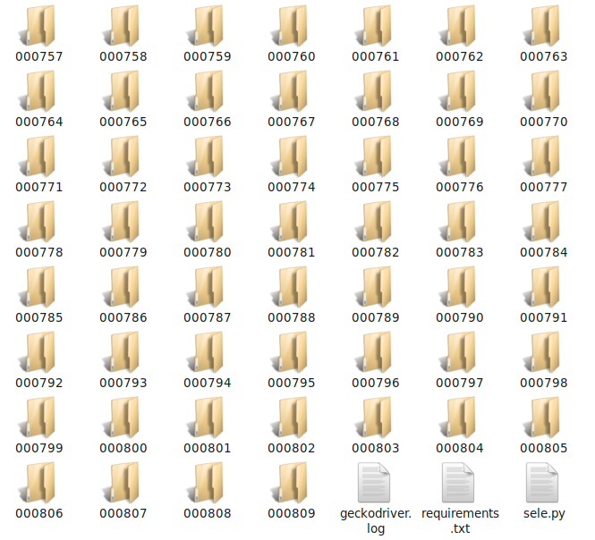
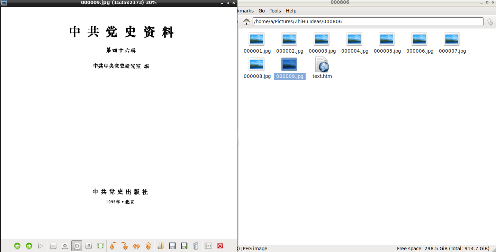

# --ZhiHu-Ideas-Catch
知乎想法抓取-ZhiHu-Ideas-Catch

# 使用教程

1.python -m pip install -r requirements.txt或pip install -r requirements.txt。

2.安裝好，參照的使用教程。

3.修改sele.py中的gong-ge-cheng-52修改為你所要抓取的知乎用戶的HTTP ID。

4.python sele.py。

# 抓取效果

想法將會從最後一頁開始記錄到第一頁，使用這樣的排序方式便於同步以後的想法數據。
